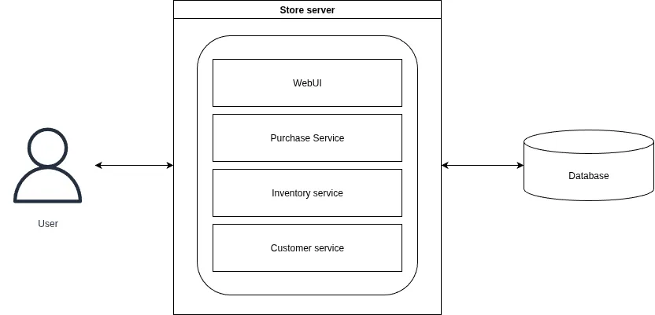

# Monolithic Architecture

### Pengertian

Arsitektur monolitik adalah suatu konsep desain aplikasi dimana setiap komponen dan layer dari aplikasi dibuat sebagai bagian dari satu unit dengan hubungan erat antara satu sama lain. Ini berarti bahwa suatu komponen tidak bisa berjalan tanpa komponen lainnya dan perubahan pada satu komponen dapat memerlukan perubahan pada komponen lain. Aplikasi dengan arsitektur ini biasanya terdapat pada satu codebase yang mengandung semua komponen yang dibutuhkan untuk menjalankan aplikasi.

### Kelebihan dan Kekurangan

#### Kelebihan arsitektur monolitik:
- ***Development***
Pengembangan aplikasi lebih mudah karena aplikasi hanya terdiri dari satu codebase
- ***Maintainance***
Karena semua komponen aplikasi dan bagaimana setiap komponen berkomunikasi dapat dilihat dari satu kodebase, developer dapat memahami cara kerja aplikasi dengan lebih mudah melakukan perubahan pada kode baik untuk menambah fitur baru atau bugfixing.

#### Kekurangan arsitektur monolitik:
- ***Skalabilitas***
Pada aplikasi monolith hanya bisa dilakukan scaling dalam bentuk menduplikasi instance aplikasi termasuk komponen-komponen yang mungkin tidak butuh di-scaling.
- ***Waktu deployment***
Semua komponen pada aplikasi monolitik perlu dideploy ulang ketika dilakukan update pada salah satu komponen.
- ***Reliabilitas***
Operasi seluruh aplikasi dapat terhenti ketika terjadi error pada salah satu komponen aplikasi.

### Use-case
Monolithic architecture cocok digunakan pada aplikasi sederhana dengan fitur yang terbatas. Monolithic architecture juga sesuai jika diinginkan prototyping untuk mendapatkan minimal viable product secara cepat.
### Contoh

Diatas merupakan contoh diagram arsitektur dari aplikasi monolitik. Aplikasi pada contoh adalah sebuah webapp yang bisa digunakan oleh pegawai suatu toko untuk memproses data pembelian dan inventori dari toko tersebut. Melalui grafik dapat dilihat layanan untuk manajemen inventori dan layan untuk manajemen data penjualan berada pada satu instance aplikasi yang sama.
