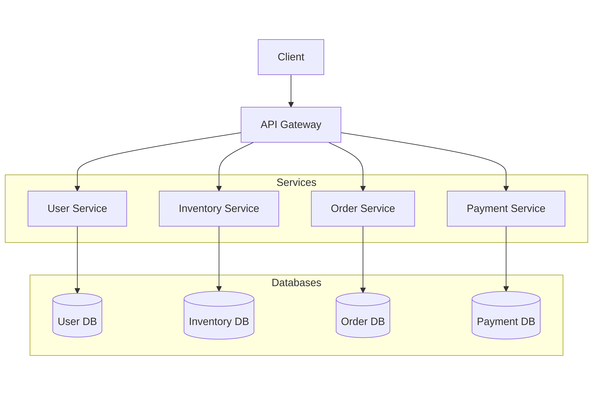

# Microservices Architecture

### Pengertian
Arsitektur microservices adalah pendekatan dalam software development dimana aplikasi dibangun sebagai kumpulan service-service kecil yang berdiri sendiri (independen). Setiap service bertanggung jawab terhadap satu fungsi spesifik dalam sistem, memiliki codebase tersendiri, serta dapat dikembangkan, diuji, dan dideploy secara mandiri tanpa bergantung pada service lain.

Layanan-layanan ini saling berkomunikasi melalui API (biasanya menggunakan protokol HTTP/REST, gRPC, atau messaging system seperti RabbitMQ).
### Kelebihan dan Kekurangan

#### Kelebihan arsitektur mikroservis:
- Skalabilitas Tinggi
    Setiap service dapat diskalakan secara independen sesuai dengan kebutuhan. 

- Pengembangan Lebih Fleksibel
    Tim yang berbeda dapat mengembangkan dan merilis fitur pada service masing-masing dengan teknologi dan jadwal yang berbeda. Hal ini sangat cocok untuk tim besar yang bekerja paralel.

- Deployment Terpisah
    Update pada satu service tidak memerlukan deployment ulang seluruh aplikasi. 

#### Kekurangan arsitektur mikroservis:
- Kompleksitas Sistem Tinggi
    Koordinasi antar banyak service memerlukan sistem orkestrasi dan komunikasi yang kompleks. 

- Overhead Operasional
    Memerlukan effort lebih besar dalam hal monitoring, logging, testing, dan deployment.

### Use-case
Arsitektur microservices cocok digunakan untuk:
- Aplikasi berskala besar dengan banyak fitur dan tim pengembang yang terpisah.
- Sistem yang membutuhkan availability dan skalabilitas tinggi.
### Contoh

- Client: Frontend yang berinteraksi dengan sistem.

- API Gateway: Titik masuk utama ke sistem yang meneruskan permintaan ke service terkait.

- Service-service independen:
    - User Service: menangani autentikasi dan data pengguna.
    - Inventory Service: mengelola stok barang.
    - Order Service: mencatat dan memproses pesanan.
    - Payment Service: menangani transaksi pembayaran.

- Database: Setiap service memiliki database sendiri untuk menghindari tight coupling antar service.
