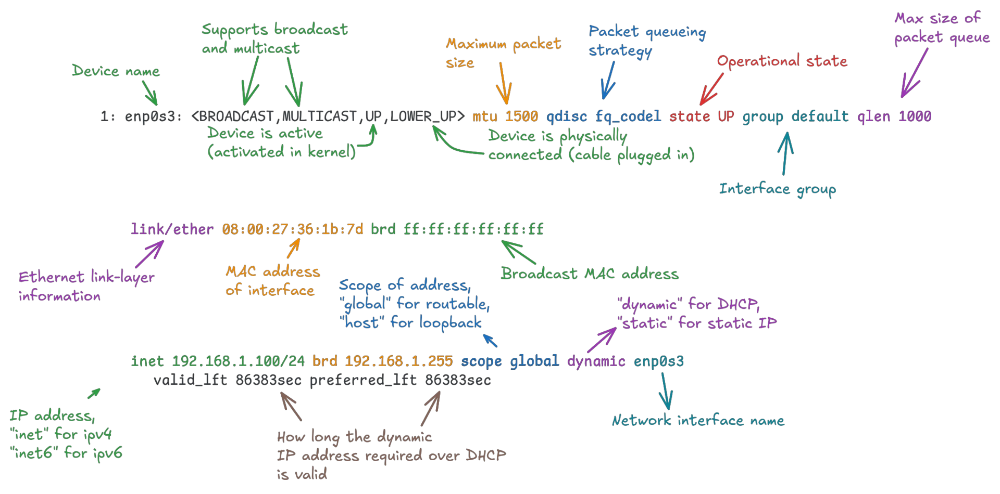

# Netwoking tools

Komponen utama networking pada Linux:

- **_Network Interface_**:
  interface yang mewakili hubungan machine dengan suatu network. Dapat mewakili physical device seperti ethernet atau wi-fi dan virtual device sepert vpn
- **_IP address_**:
  Sistem untuk mengidentifikasi device dalam suatu network
- **_Routing_**:
  Proses untuk pengarahan paket antar network.

### command ip

iproute2 adalah network management tools yang menjadi pengganti dari net-tools. Salah satu tools yang disediakan oleh iproute2 adalah command ip yang digunakan untuk memanipulasi routing table, network interface, dan ip address.

Perubahan yang diakibatkan oleh command ip bersifat sementara dan akan hilang setiap dilakukan reboot. Agar konfigurasi bisa menjadi permanen, bisa digunakan script atau systemd service untuk menjalankan command ip setiap startup.

#### interface

##### Menampilkan semua network interface dengan `ip link`

Contoh:

```bash
$ ip link show
1: lo: <LOOPBACK,UP,LOWER_UP> mtu 65536 qdisc noqueue state UNKNOWN mode DEFAULT group default qlen 1000
    link/loopback 00:00:00:00:00:00 brd 00:00:00:00:00:00
2: enp3s0: <NO-CARRIER,BROADCAST,MULTICAST,UP> mtu 1500 qdisc fq_codel state DOWN mode DEFAULT group default qlen 1000
    link/ether b4:a9:fc:c3:d6:29 brd ff:ff:ff:ff:ff:ff
    altname enxb4a9fcc3d62
```

Penjelasan output:

```bash
2: eth0: <BROADCAST,MULTICAST,UP,LOWER_UP> mtu 1500 qdisc mq state UP mode DEFAULT group default qlen 1000
    link/ether 00:1a:2b:3c:4d:5e brd ff:ff:ff:ff:ff:ff
```

- Baris pertama (interface header)

| Field                               | Meaning                                             |
| ----------------------------------- | --------------------------------------------------- |
| `2:`                                | index                                               |
| `eth0:`                             | nama interface                                      |
| `<BROADCAST,MULTICAST,UP,LOWER_UP>` | kapabilitas dan status interface                    |
| `mtu 1500`                          | batas maksimal ukuran paket dalam byte              |
| `qdisc mq`                          | queuing discipline                                  |
| `state UP`                          | status interface (`UP`, `DOWN`, `UNKNOWN`)          |
| `mode DEFAULT`                      | mode operasional                                    |
| `group default`                     | Group name for managing interfaces collectively     |
| `qlen 1000`                         | Queue length (number of packets that can be queued) |

- Baris kedua(link layer information)

| Field                   | Meaning                         |
| ----------------------- | ------------------------------- |
| `link/ether`            | tipe link                       |
| `00:1a:2b:3c:4d:5e`     | MAC address dari interface      |
| `brd ff:ff:ff:ff:ff:ff` | alamat broadcast dari interface |

##### Konfigurasi interface dengan subcommand `ip link set`

Syntax:

```bash
$ ip link set [DEVICE] [OPTIONS...]
```

Contoh:

- `ip link set eth0 down`: mengubah status dari interface eth0 menjadi down
- `ip link set eth0 mtu 1500`: mengubah mtu dari interface eth0 menjadi 1500 byte
- `ip link set eth0 address ff:ff:ff:ff:ff:ff`: mengubah MAC adress dari interface eth0

#### ip address

##### Menampilkan IP address dari semua interface machine dengan subcommand `ip address show`

Contoh:

```bash
$ ip address show
2: ens33: <BROADCAST,MULTICAST,UP,LOWER_UP> mtu 1500 qdisc fq_codel state UP group default qlen 1000
    link/ether 00:0c:29:3e:5b:77 brd ff:ff:ff:ff:ff:ff
    inet 192.168.1.10/24 brd 192.168.1.255 scope global dynamic noprefixroute ens33
       valid_lft 86397sec preferred_lft 86397sec
    inet6 fe80::20c:29ff:fe3e:5b77/64 scope link noprefixroute
       valid_lft forever preferred_lft forever
```

Penjelasan output:


##### Modifikasi IP address

- `ip address add {ip_address} dev eth0`: menambahkan IP address pada interface eth0:
- `ip address del {ip_address} dev eth0`: menghapus IP address dari interface eth0:

#### routing table

##### Tampilkan main routing table dengan `ip route`

Contoh:

```bash
$ ip route
default via 192.168.0.126 dev eth0 proto dhcp src 192.168.0.106 metric 100
172.17.0.0/16 dev br-d475b34f92ec proto kernel scope link src 172.17.0.1
192.168.0.0/24 dev eth0 proto kernel scope link src 192.168.0.106 metric 100
```

Penjelasan output:

1.  **`192.168.0.0/24`**
    - menspesifikasikan network tujuan
    - `/24` menspesifikasikan subnet mask

2.  **`dev eth0`**
    - menspesifikasikan interface yang akand digunakan untuk rute ini

3.  **`proto kernel`**
    - bagaimana rute dibuat
    - `kernel` berarti rute ditambahkan oleh kernel
4.  **`scope link`**
    - Mendefinisikan scope dari route
    - `link` berarti network tujuan bisa langsung diakses tanpa melewati gateway atau router
5.  **`src 192.168.0.106`**
    - mendefinikasikan ip address yang akan digunakan untuk mengirimkan paket ke route
6.  **`metric 100`**
    - prioritas dari rute, dimana angka yang lebih rendah memiliki prioritas lebih tinggi

Secara singkat, paket yang memiliki penerima yang berada pada network 192.168.0.0/24 akan diteruskan melalui interface eth0 dengan ip pengirim di-set menjadi 192.168.0.106.

##### Menambahkan routing rule baru dengan `ip route add`

Syntax:

```bash
$ ip route add [DESTINATION] via [GATEWAY] dev [INTERFACE] metric [METRIC]
```

Contoh:

- `ip route add 192.168.0.0/24 via 192.168.0.1 dev eth0`: Tambahkan routing rule baru yang akan mengarahkan semua paket yang menuju ke network 192.168.0.0/24 melalui gateway 192.168.0.1 menggunakan interface eth0
