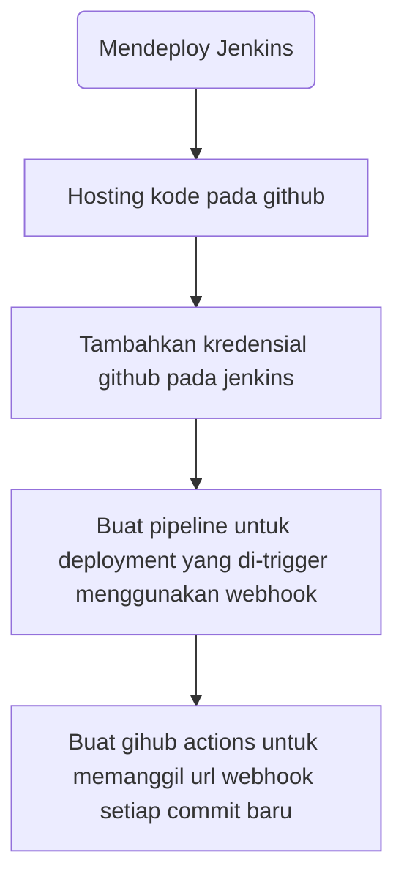

# Workflow untuk mempersiapkan deployment pada jenkins
Berikut adalah flowchart untuk mempersiapkan proses deployment program yang di-host pada github menggunakan pipeline Jenkins yang di-trigger melalui webhook

### A. Mendeploy Jenkins
Pastikan jenkins telah terdeploy dan terdapat agen yang aktif untuk menjalankan pipeline deployment. Jika ingin menggunakan webhook sebagai trigger, pastikan jenkins bisa diakses melalui internet. Hal ini bisa dicapai menggunakan public ip address atau layanan reverse proxy seperti ngrok atau zrok. Pastikan juga bahwa jenkins dapat menjalankan tools yang dibutuhkan untuk 
### B. Hosting kode
Kode dari program yang akan di-deploy sebaiknya di hosting di layanan yang menyediakan layanan automasi seperti github actions yang memungkinkan menjalankan script setiap terjadi commit baru pada repository.
### C. Tambahkan kredensial pada jenkins
Jika repository bersifat private, diperlukan kredensial untuk melakukan clone terhadap repository tersebut. Jenkins menyediakan plugin untuk menyimpad kredensial git yang dapat berupa secret token atau ssh-private-key
### D. Buat pipeline jenkins
Pipeline ini minimal perlu melakukan cloning terhadap repo kemudian melakuan building menggunakan kode yang telah di-pull. Pada opsi pemilihan trigger, pilih webhook, akan didapat url yang perlu dipanggil untuk memulai pipeline.
### E. Panggil url webhook dari github actions
Pada script github actions, panggil url yang telah dispesifikasikan pada langkah D menggunakan curl. Untuk menyimpan token secret yang digunakan untuk autentikasi oleh jenkins, github menyediakan layanan github secret untuk menyimpan data sensitif seperti api token. Token yang disimpan pada github secret dapat melalui variabel
