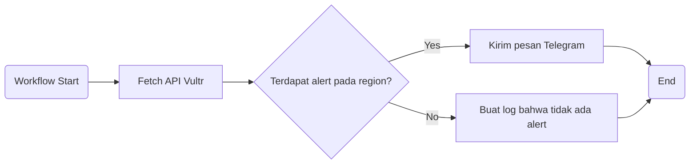
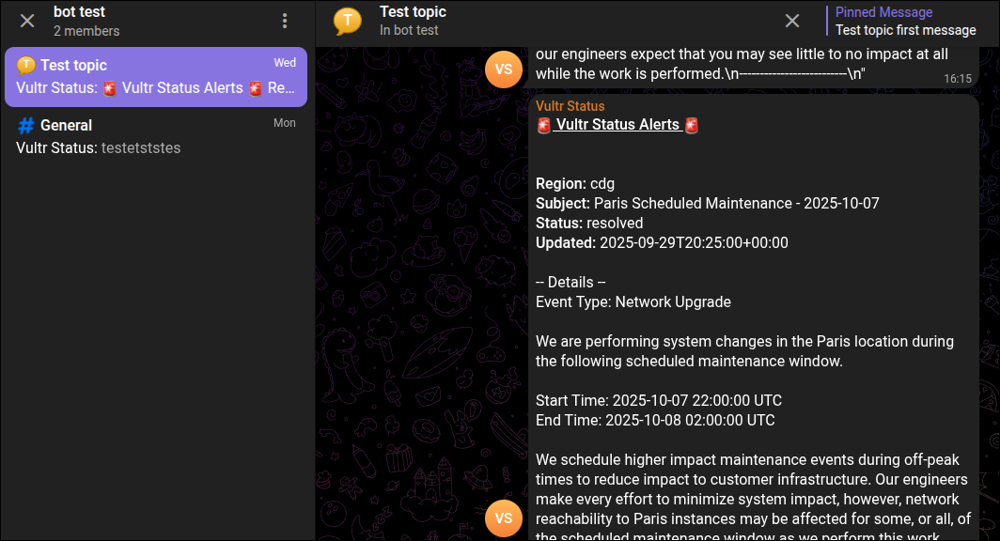

# Sistem Notifikasi Vultr melalui Telegram

### Overview
Sistem ini berfungsi untuk mengambil informasi alert daerah servie tertentu dari API Vultr kemudian mengirimkan detail alert melalui telegram. Sistem akan dibuat dengan github actions.

Alur kerja github actions:

### API Vultr

Vultr menyediakan API pada alamat https://status.vultr.com/status.json yang jika diakses akan mengembalikan data JSON yang mengandung daftar regions yang dilayani oleh Vultr beserta status server Vultr pada region tersebut dalam bentuk field alert yang mengandung detail tentang gangguan yang sedang terjadi.

Berikut adalah contoh respons json dari API tersebut:

```json
{
    "service_alerts": [],
    "regions": {
        "atl": {
            "location": "Atlanta",
            "country": "US",
            "country_name": "United States",
            "alerts": [
                {
                    "id": "80349394-43b0-438a-ba4d-ac05a726deb2",
                    "subject": "Atlanta Scheduled Maintenance - 2020-11-10",
                    "status": "ongoing",
                    "start_date": "2020-11-02T16:07:00+00:00",
                    "updated_at": "",
                    "entries": [
                        {
                            "updated_at": "2020-11-02T16:07:00+00:00",
                            "message": "..."
                        }
                    ]
                },
            ...   
            ]
        },
...
```
Data json ini dapat diolah langsung dengan bash menggunakan utility bernama jq. Program yang dapat melakukan manipulasi terhadap text json sebagai input. Berikut adalah contoh penggunaan program jq:
```bash
$ curl -s https://status.vultr.com/status.json | jq ".regions.$REGION_CODE.alerts"
[
  {
    "id": "eff0a7fc-3e34-4386-9ca7-27c93ef7dc43",
    "subject": "Mumbai Degraded Network Performance",
    "status": "ongoing",
    "start_date": "2025-09-08T19:06:00+00:00",
    "updated_at": "",
    "entries": [
      {
        "updated_at": "2025-09-08T19:06:00+00:00",
        "message": "We are currently experiencing degraded network performance in our Bangalore location with international connectivity to India.  You may experience slower speeds or intermittent connectivity across all of our upstream transit providers. We will provide updates as more information becomes available."
      }
    ]
  }
]
```
### Telegram Bot

Telegram menyediakan fitur bot yang bisa digunakan untuk mengirim pesan pada akun atau grup yang ditentukan melalui API bot telegram. Untuk keperluan sistem notifikasi ini, berikut adalah request yang akan digunakan untuk mengirim pesan berisi notifikasi alert vultr.

```bash
curl -s -X POST "https://api.telegram.org/bot${TELEGRAM_BOT_TOKEN}/sendMessage" \
    --data-urlencode "chat_id=${TELEGRAM_CHAT_ID}" \
    --data-urlencode "message_thread_id=${TELEGRAM_THREAD_ID}" \
    --data-urlencode "text=${ALERT_MESSAGE}" \
    --data-urlencode "parse_mode=HTML"
```
Penjelasan:
- ***URI***: URL yang diperlukan untuk mengirim pesan dengan bot telegram. Variabel $TELEGRAM_BOT_TOKEN merupakan token bot telegram bot yang didapat setelah men-generate bot telegram baru
- ***Body post request***:
    - ***chat_id***: ID dari akun atau grup yang akan menerima pesan dari bot. Data chat_id bisa didapat dari url pada address bar browser ketika mengakses group yang terkait pada telegram web. Bot harus sudah menjadi member dari grup untuk dapat mengirimkan pesan. Username bot untuk memasukkan bot ke grup yang ditarget dapat didapat melalui URI `/getMe`.
    - ***message_thread_id***: ID dari subgroup/topic kemana pesan akan ditujukan. Thread ID ini bisa didapatkan dari url yang digunakan untuk membagikan topic, Contoh: `https://t.me/c/{chat_id}/{message_thread_id}`.
    - ***parse_mode***: Bagaimana pesan text mentah akan diparse untuk dirender pada klien telegram. Terdapat opsi markdown dan html untuk mengisi field ini. 
    - ***text***: Isi dari pesan yang akan dikirimkan. Simbol-simbol spesial seperti tag html atau markdown pada field ini akan ditampilkan pada klien telegram berdasarkan parse_mode yang dipilih.

### Github Actions
```yaml
name: Monitor Vultr Status
on:
  # schedule:
  #   - cron: '0 * * * *'
  workflow_dispatch: # workflows hanya akan berjalan dengan secara manual
env:
  REGION_CODE: ${{ vars.VULTR_REGION_TEST_WAHYU }}
jobs:
  monitor_vultr_status:
    runs-on: solutionlabs
    steps:
      - name: Fetch Vultr Status
        id: fetch_status
        env:
          VULTR_API_URL: "https://status.vultr.com/status.json"
        run: |
          set -e
          echo "Fetching status from Vultr..."
          response=$(curl -fsSL "$VULTR_API_URL" || echo "")
          if [ -z "$response" ]; then
            echo "Error: Failed to fetch status from Vultr"
            exit 1
          fi

          alerts=$(echo "$response" | jq -c ".regions.${REGION_CODE}.alerts // []")
          if [ "$(echo "$alerts" | jq 'length')" -eq 0 ]; then
            echo "No active alerts for region ${REGION_CODE}"
            echo "has_alerts=false" >> "$GITHUB_OUTPUT"
          else
            alerts_base64=$(echo "$alerts" | base64 -w0)
            echo "alerts_base64=$alerts_base64" >> "$GITHUB_OUTPUT"
            echo "has_alerts=true" >> "$GITHUB_OUTPUT"
          fi

      - name: Send Telegram Message
        if: steps.fetch_status.outputs.has_alerts == 'true'
        env:
          TELEGRAM_BOT_TOKEN: "${{ secrets.TELEGRAM_BOT_ID }}"
          TELEGRAM_CHAT_ID: "${{ secrets.TELEGRAM_CHAT_ID_TEST_WAHYU }}"
          TELEGRAM_THREAD_ID: "${{ secrets.TELEGRAM_TOPIC_ID_TEST_WAHYU }}"
          REGION_CODE: ${{ env.REGION_CODE }}
        run: |
          ALERTS=$(echo "${{ steps.fetch_status.outputs.alerts_base64 }}" | base64 -d)

          echo "<u><b>🚨 Vultr Status Alerts 🚨</b></u>" > message.txt
          echo "" >> message.txt

          echo "$ALERTS" | jq -c '.[]' | while read -r alert; do
            SUBJECT=$(echo "$alert" | jq -r '.subject')
            STATUS=$(echo "$alert" | jq -r '.status')
            BODY=$(echo "$alert" | jq -r '.entries[0].message')
            UPDATED_AT=$(echo "$alert" | jq -r '.entries[0].updated_at')

            printf '\n<b>Region:</b> %s\n<b>Subject:</b> %s\n<b>Status:</b> %s\n<b>Updated:</b> %s\n\n-- Details --\n%s\n' \
              "$REGION_CODE" "$SUBJECT" "$STATUS" "$UPDATED_AT" "$BODY" >> message.txt
            echo "--------------------------" >> message.txt
          done
          echo "bot id:${TELEGRAM_BOT_TOKEN%%:*}"
          ALERT_MESSAGE=$(cat message.txt)
          curl -s -X POST "https://api.telegram.org/bot${TELEGRAM_BOT_TOKEN}/sendMessage" \
            --data-urlencode "chat_id=${TELEGRAM_CHAT_ID}" \
            --data-urlencode "message_thread_id=${TELEGRAM_THREAD_ID}" \
            --data-urlencode "text=${ALERT_MESSAGE}" \
            --data-urlencode "parse_mode=HTML"

      - name: Log No Alert
        if: steps.fetch_status.outputs.has_alerts != 'true'
        run: echo "no active alerts"
```
File Github action ini memiliki satu job yang terdiri dari tiga step:
- ***monitor vultr status***:  
    Pada step ini, dilakukan request pada url API status vultr menggunakan curl. Respons dari request ini kemudian difilter menggunakan utililty jq untuk untuk mendapatkan alert pada region yang diinginkan. Jika Array alert pada region tersebut kosong, variabel has_alerts akan di set menjadi false. Sebaliknya, Isi field alert pada data json akan diencode menjadi base64 kemudian disimpan pada variable output alerts_base64 dan variabel has_alerts akan di set menjadi false. Tujuan penyimpanan data alerts menjadi base64 adalah untuk mencegah terjadinya perubahan formatting data seperti penghapusan double quote atau bracket yang menjadikan data menjadi json yang invalid.
- ***send telegram message***:
    Step ini hanya akan dijalankan jika variabel output has_alerts dari step sebelumnya berisi true. Data alerts dari variable alerts_base64 akan didecode menjadi data json seperti semula. Isi message telegram akan dibuat berdasarkan data alerts dengan mengambil value field yang penting seperti subject, status, time, serta detail alert tersebut.

    Setelah text dari message dibuat, akan dilakukan POST request terhadap API telegram dengan field yang sudah dispesifikasikan pada bagian sebelumya. 
- ***log no alert***:
    Step akan dijalankan jika value variabel output has_alerts adalah false dan berfungsi untuk menulis log bahwa tidak ada alert yang perlu dikirmkan. 

### Demo
Berikut adalah hasil penjalanan workflow diatas pada klien telegram:

